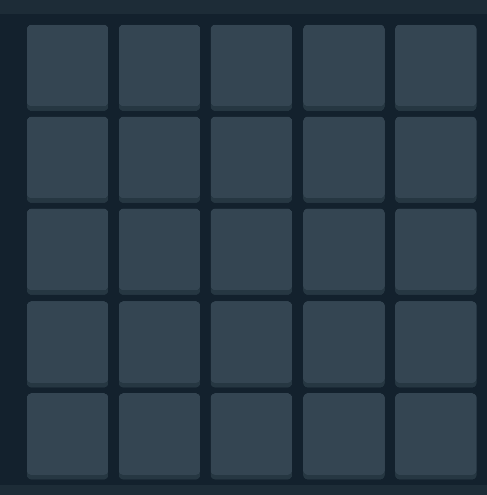
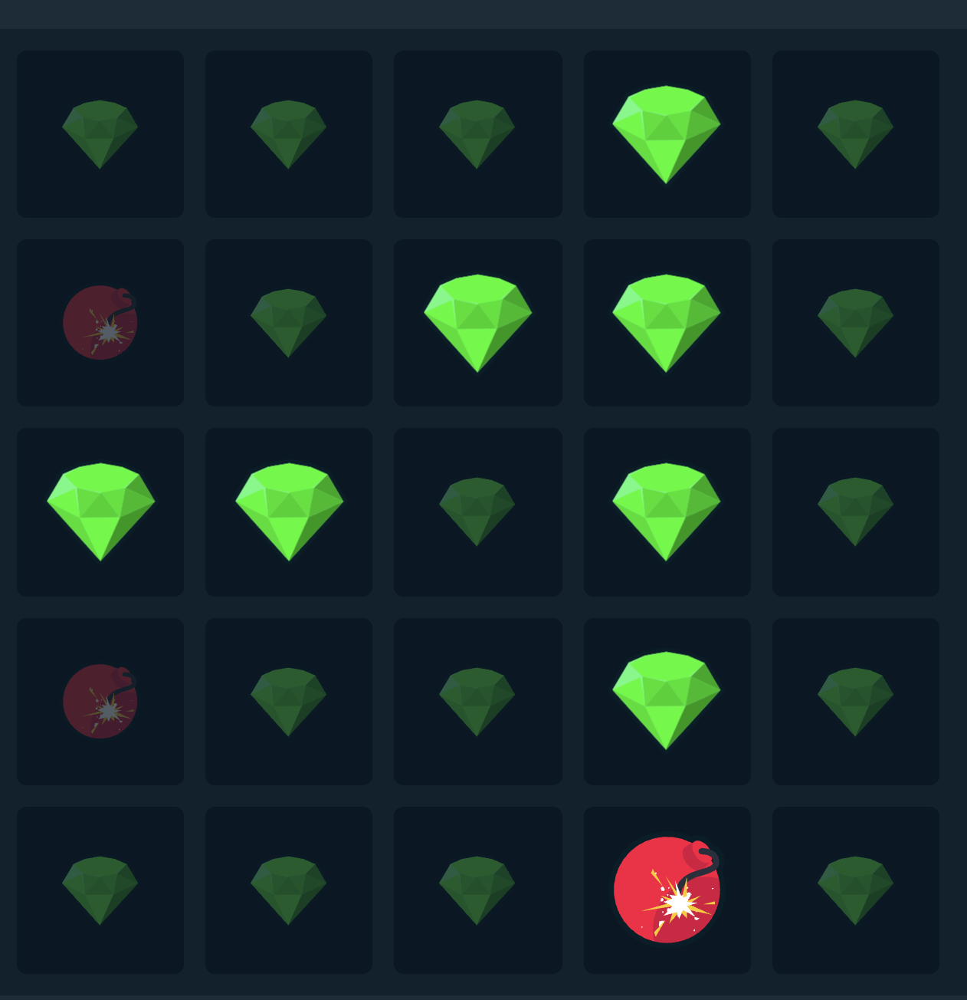
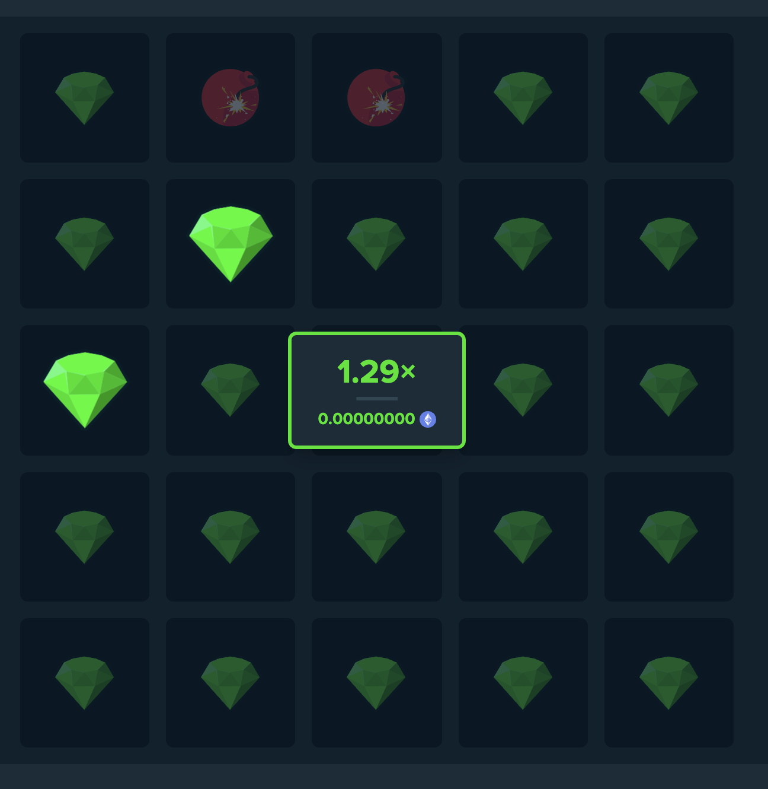

# Easygo Mines

You can try to play mines on the staging environment to get an idea how the game works
1. Go to our staging site - [Stake](https://staging-stake-com.vercel.app/casino/games/mines)
2. Create an account
3. Play the game

## Instructions
1. Mines game is a 5 to 5 grid game (5 columns, 5 rows)

2. Once a mine is revealed game ends, if it's a gem (not a mine) game continues. Following screenshot is a game that ended (due to clicking on mine). You can differentiate between gems & mines that got revealed.

3. You can cashout at any time and the game state will be revealed. Don't implement 1.29x payout image.

4. Create "Bet" button (possible to click at all times except "progress" and loading state).

5. Create "Cashout" button (only possible to click on cashout if you are in the middle of the game state "progress" and you have revealed at least of the tiles and you are not waiting for a server response (eg. to reveal next tile)).

6. By default game has a 5 mines (if you can make it possible to play with more it's a plus, but not mandatory)

7. USE "assets" folder to get gem and mine image.

8. USE "packages/api" file to call external api. For example, you can do `import { minesBet } from "api"`. We have three mutations available, you will need to use them all.

9. Play a sound when mine or gem is revealed. Use gem.mp3 and mine.mp3 from assets.

10. When a mine or gem is being revealed (in loading state),
* <b>Junior</b>: Ensure that user is blocked from revealing other tiles.
* <b>Mid/Senior</b>: Ensure that user can still reveal other tiles and that they are revealed in order that they were clicked.

11. Try to focus on great user experience and add some animations that make the game exciting

## Things to focus on
1. <b>Clean and readable code</b>
2. <b>Component reusability</b>
3. <b>State Management</b>
4. <b>Responsive design</b> - mobile & desktop view
5. <b>Great user experience</b> - animations, etc.
6. <b>Handling of loading states</b>

## Some useful color codes for styling purposes, feel free to use any other
--primary: #1a2c38 

--secondary: #0f212f 

--tertiary: #304654 

--success: #00e701 

--grayscale-grey: #b1bad3 

--grayscale-white: #ffffff 

## Implementation
We've created three different templates for you to work from. Pick whichever framework you feel the most comfortable with.

## Symlink api package
1. `npm link` in package
2. `npm link api` in project directory

## Running the project (React)
1. run `yarn install`
2. run `yarn dev`
3. to make changes to the react app, go to `apps/react-mines`

## Running the project (Svelte)
1. run `yarn install`
2. run `yarn dev:svelte`
3. to make changes to the svelte app, go to `apps/svelte-mines`

## Running the project (Vue)
1. run `yarn install`
2. run `yarn dev:vue`
3. to make changes to the vue app, go to `apps/vue-mines`
